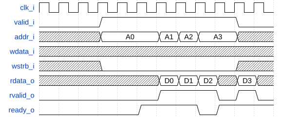

<!--
SPDX-FileCopyrightText: 2024 IObundle

SPDX-License-Identifier: MIT
-->

# IOb-Tasks

IOb-Tasks is verification tasks for use in a testbench that drives an IP core
with a IOb Native Interface. The tasks are written in Verilog and can be used
with any simulator that supports Verilog. In addition, equivalent tasks are
provided in C for use with the Verilator simulator. Two tasks are provided:
`iob_write` and `iob_read`. These tasks are used to write and read data to and
from the IP core, respectively.

The IOb Native Interface, or IOb interface shortly, has the following signals
from the slave perspective. (Note that the `_i` and `_o` suffixes denote input
and output, respectively.)
- `clk_i`: interface input clock
- `valid_i`: source signal valid transaction from master input
- `addr_i`: address for read or write access input
- `wdata_i`: data to write
- `wstrb_i`: byte write strobe input
- `rdata_o`: read data
- `rvalid_o`: valid read data
- `ready_o`: slave ready for transaction output

Transactions occur when both `valid_i` and `ready_o` are HIGH for one `clk_i`
period.

Use `wstrb_i` to distinguish between READ and WRITE operations. READ operations
occur when all `wstrb_i` bits are LOW.
Byte `i` is written if `wstrb_i[i]` is HIGH and not otherwise.

## Read Transaction
For READ operations: when `valid_i` and `ready_o` are HIGH, address `addr_i` is
read. The data on `rdata_o` is available when `rvalid_o` is HIGH.

## Write Transaction
For WRITE operations: when `valid_i` and `ready_o` are HIGH, the bytes in
`wdata_i` validated by `wstrb_i` are written to address `addr_i.`

